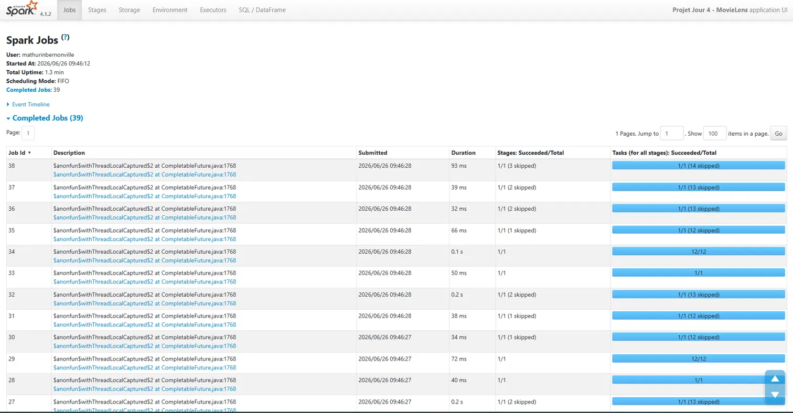
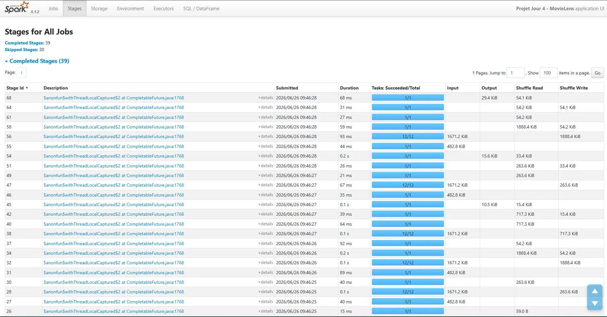
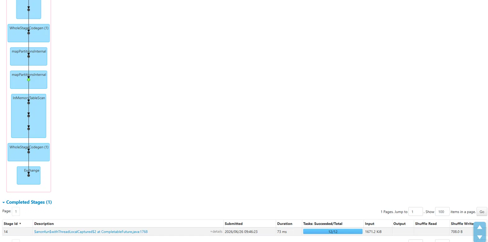
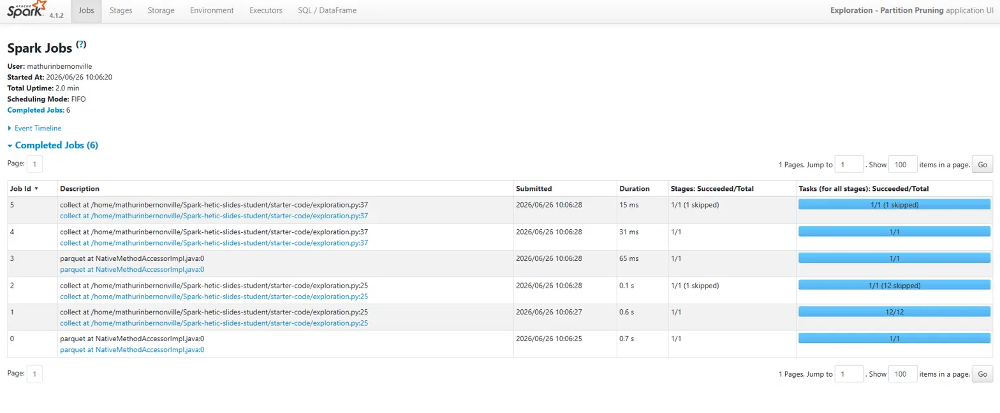

# Rapport projet jour 4 - Pipeline Spark MovieLens

**Auteurs :** Alexandre Breville & Mathurin Bernonville  
**Date :** 26 juin 2026  
**Dataset :** MovieLens small (ml-latest-small)  
**Environnement :** Spark 4.1.2, PySpark, mode local, WSL2 Ubuntu 24.04

---

## 1. Données et schéma

MovieLens small contient les notes de films données par des utilisateurs, avec une table de référence des films et leurs genres.

Deux fichiers sources :
- `ratings.csv` - 100 836 lignes : `userId`, `movieId`, `rating`, `timestamp`
- `movies.csv` - 9 742 lignes : `movieId`, `title`, `genres`

Schéma cible après nettoyage (couche silver) :

| Colonne   | Type      | Note                              |
|-----------|-----------|-----------------------------------|
| userId    | Integer   |                                   |
| movieId   | Integer   |                                   |
| rating    | Float     | 0.5 à 5.0                         |
| date_note | Timestamp | Converti depuis le timestamp Unix |
| annee     | Integer   | Dérivé de date_note, sert au partitionnement |

---

## 2. Pipeline

### Bronze -> Silver

Lecture de `ratings.csv` avec un schéma explicite (StructType). J'ai volontairement évité `inferSchema` qui peut mal typer des colonnes sur du CSV : ici le timestamp serait probablement lu comme string.

Transformations :
- Conversion du timestamp Unix en date (`to_timestamp`), puis extraction de l'année
- Filtre sur les notes hors bornes (`rating < 0.5` ou `rating > 5.0`)
- Déduplication sur `(userId, movieId)`
- Suppression des nulls (`na.drop`)

Résultat : 100 836 lignes -> 100 836 lignes. Les données MovieLens sont déjà propres, aucune ligne écartée.

Écriture en Parquet partitionné par `annee` (~30 valeurs distinctes). Ce choix de partitionnement est testé dans la partie exploration.

### Silver -> Gold

Relecture de la couche silver Parquet. `df_ratings` est mis en cache avant les 3 analyses car il est réutilisé à chaque fois. Sans ça, Spark relirait le Parquet 3 fois depuis le disque. Le `count()` qui suit le `cache()` force la matérialisation immédiate.

---

## 3. Analyses

### Analyse 1 - Films les mieux notés (agrégation)

Quels films ont la meilleure note moyenne, avec un minimum de 50 notes ?

```python
df_ratings.groupBy("movieId")
    .agg(F.count("rating").alias("nb_notes"), F.avg("rating").alias("note_moyenne"))
    .filter(F.col("nb_notes") >= 50)
    .orderBy(F.desc("note_moyenne"))
```

Résultats :

| movieId | nb_notes | note_moyenne |
|---------|----------|--------------|
| 318     | 317      | 4.43         |
| 858     | 192      | 4.29         |
| 2959    | 218      | 4.27         |

Le film 318 (The Shawshank Redemption) arrive en tête avec 4.43/5 sur 317 votes. Le seuil de 50 notes est important : sans lui, des films avec 1 ou 2 notes à 5.0 monopolisent le classement, ce qui n'a pas de valeur métier.

---

### Analyse 2 - Note moyenne par genre (jointure broadcast)

Quels genres obtiennent les meilleures notes en moyenne ?

```python
df_ratings.join(F.broadcast(df_movies), on="movieId", how="inner")
    .groupBy("genres")
    .agg(F.count("rating").alias("nb_notes"), F.avg("rating").alias("note_moyenne"))
```

`movies.csv` fait ~9 700 lignes, c'est la candidate naturelle pour un broadcast. Sans ça, Spark devrait shuffler les deux tables pour les aligner sur `movieId`. Durée mesurée : 0.86s.

Le résultat brut montre des combinaisons de genres très spécifiques avec 1 seule note à 5.0 en tête du classement. Même problème qu'en analyse 1, un seuil de votes minimum serait nécessaire pour une lecture fiable.

---

### Analyse 3 - Top 5 par genre (window function)

Quel est le meilleur film de chaque genre, parmi ceux ayant au moins 20 notes ?

```python
fenetre = Window.partitionBy("genres").orderBy(F.desc("note_moyenne"))
df_film_genre
    .withColumn("rang", F.row_number().over(fenetre))
    .filter(F.col("rang") <= 5)
```

Résultats (extrait) :

| genres            | title                           | note_moyenne | rang |
|-------------------|---------------------------------|--------------|------|
| Action\|Adventure | Raiders of the Lost Ark (1981)  | 4.21         | 1    |
| Action\|Adventure | Indiana Jones - Last Crusade    | 4.05         | 2    |

La window function évite d'avoir à faire un `groupBy` + jointure avec un sous-résultat. Le classement est indépendant par partition de genres, ce qui est exactement ce qu'on veut ici.

---

## 4. Optimisation

Deux optimisations dans le pipeline :

**Cache sur df_ratings** : réutilisé par les 3 analyses. La Spark UI le confirme : les jobs après matérialisation montrent `InMemoryTableScan` dans le DAG au lieu d'une lecture Parquet.

**Broadcast join sur movies** : 9 700 lignes diffusées à chaque executor, pas de shuffle côté movies. Durée de l'analyse 2 : 0.86s. Sans broadcast, la jointure aurait impliqué un shuffle des 100 836 lignes de ratings pour les aligner avec movies.

---

## 5. Spark UI



39 jobs complétés en 1.3 min. Les jobs avec 12/12 tasks sont ceux qui ont produit un shuffle (groupBy, window function). Les autres avec "skipped" ont profité du cache.



Le stage 56 montre 1671.2 KiB en Shuffle Read et 1888.4 KiB en Shuffle Write. C'est l'agrégation par genre qui redistribue les données entre partitions.



Le nœud `Exchange` est le point de shuffle. En amont, `InMemoryTableScan` confirme la lecture depuis le cache. `WholeStageCodegen` indique que Spark a fusionné plusieurs opérations en un seul passage pour limiter les allers-retours JVM.

---

## 6. Exploration - partition pruning

J'ai testé l'impact du partitionnement par `annee` sur les temps de lecture. Le principe : quand on filtre sur la colonne de partitionnement, Spark peut ignorer physiquement les répertoires des autres valeurs sans lire les fichiers.

**Protocole :** même agrégation (`avg(rating)`) sur la couche silver, une fois sans filtre, une fois avec `filter(annee == 2015)`. Même session, même machine.

| Condition          | Durée  | Tasks |
|--------------------|--------|-------|
| Sans filtre        | 2.115s | 12/12 |
| Avec filtre (2015) | 0.202s | 1/1   |
| Gain               | 90.5%  |       |

Le plan d'exécution confirme que le pruning a bien lieu :
```
PartitionFilters: [isnotnull(annee#25), (annee#25 = 2015)]
```



Job 1 sans filtre : 12 tasks en 0.6s. Job 4 avec filtre : 1 task en 31ms.

Le gain de 90.5% sur un volume aussi petit est déjà significatif. Sur un dataset de plusieurs Go partitionné par mois, l'effet serait encore plus marqué. C'est pour ça que le choix de la colonne de partitionnement est une vraie décision d'architecture.

---

## 7. Bilan et limites

Ce que j'ai retenu de ce projet :

Le schéma explicite sur CSV vaut vraiment la peine d'être systématique : `inferSchema` est pratique mais peu fiable sur des colonnes ambiguës. Le cache n'a de sens que si le DataFrame est réellement réutilisé plusieurs fois, et il faut le matérialiser avec un `count()` immédiatement sinon Spark peut le recalculer à la demande. Le broadcast join est une optimisation simple à mettre en place dès qu'une table est petite.

Limites :

MovieLens small est trop petit pour vraiment stresser Spark : les temps sont dominés par l'overhead JVM, pas par le volume de données. Les mesures de performance seraient plus fiables moyennées sur plusieurs runs.

L'encodage des genres en chaîne unique (`Action|Adventure`) crée des milliers de combinaisons distinctes et rend l'analyse par genre peu exploitable en l'état. Un `explode(split(genres, "\\|"))` normaliserait ça et donnerait des résultats plus propres.
